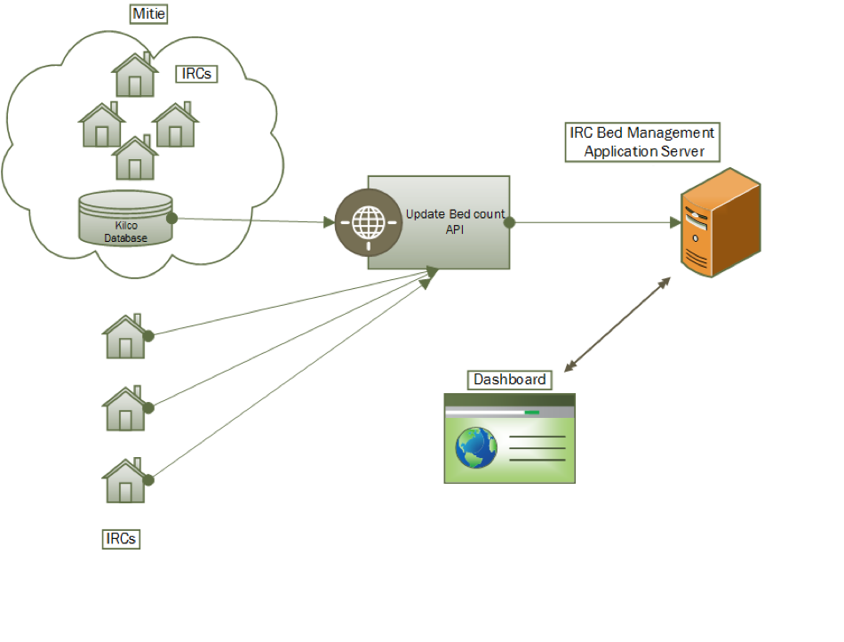

# Bed Space Management Interface Control Document and schema

## Purpose and Scope
This document describes the interface between IRC Bed Management and its data providers
The purpose of the document is to detail the interactions available between each IRC platform and the Home Office dashboard for Bed Allocation by DEPMU and describes the metadata and security arrangements for the data.

## OWNERSHIP AND CONTROL

### ICD Ownership
This ICD is currently owned by Home Office Digital on behalf of the IDP.

### ICD Maintenance Policy
Proposed changes to this ICD and schema will be managed via [Github pull requests](https://help.github.com/articles/using-pull-requests/)
Any material change to this ICD will need to be approved by the HO change control process.
Non-material changes such as spelling mistakes of clarifications of existing capabilities do not require the HO change control process.


## Interface Context

### Business Context
The aim of this interface is to support the processing of updates of bed occupancy and events logged in the IRCs that DEPMU operate.
The business require a technology that will aggregate, store and display data in a secure manner that is highly resilient and available.

### Conceptual Architecture Diagram

Programming interactions between IRCs and the DEPMU Bed Management Dashboard will be through a common API. 

[diagram]


The API presents the following HTTP endpoints:
- `/irc_entry/event`
- `/irc_entry/heartbeat`

## Event API
Invoked on the following events by the IRC:

1. When a detainee checked in IRC.
1. When a detainee checked out IRC.
1. When a bed becomes out of operation.
1. When a bed returns into operation.
1. When a detainee is moved between moved between two sites by the IRC.
1. When a detainee is reinstated.
1. When a detainee cid/gender/nationality is updated.

##### Process flow:
- Capture the data required as described in the schema
- Validate data with the [schema](./event.json)
- Submit to the correct endpoint (as provided to the provider) over HTTPS/TLS
- Should an error occur submitting, queue the event, and retry the queue at `1 minute` intervals raising exceptions to the relevant support party so that it can be addressed and monitored
  - timeout should be set to 5 seconds
  - `3xx` redirects should be followed
  - should a `4xx` or `5xx` error occur, 
  - consider ultimately anything (after any redirects) that result in a non `2xx` status code to be an error

## Heartbeat API
The purpose of this is to provide always up to date bed occupation and out of commission information.

Invoked at `1 minute` intervals.
##### Process flow:
- Capture the data required as described in the schema
- Validate data with the [schema](./heartbeat.json)
- Submit to the correct endpoint (as provided to the provider) over HTTPS/TLS
- Should an error occur submitting *do not queue* and raise the exception to the relevant support party so that it can be addressed and monitored.
  - Timeout should be set to 5 seconds
  - `3xx` redirects should be followed
  - Consider ultimately anything (after any redirects) that result in a non `2xx` status code to be an error

# Utilities
In this repository you will also find a tool that can be used to generate fake data which can be useful for testing and exploring the schema.
### To output 10 events to stdout
```shell
node generate.js event.json 10
```
### To output 10 heartbeats to stdout
```shell
node generate.js heartbeat.json 10
```
You can also include tagged releases of the repository in your application.
